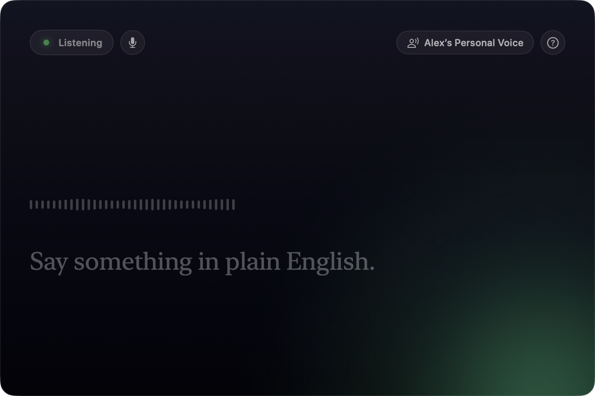

# Corpospeak

**Say what you mean, and hear it back as what you're supposed to say.** Corpospeak
listens to you talk, rewrites it as fluent corporate English, and reads the result
back in your own voice.

On the App Store as *Corpospeak: In Your Voice*. For Mac, iPhone and iPad.

## Why you'd want it

- **Talk normally, get the corporate version.** Say "this deadline is impossible"
  and hear back something you could safely repeat in a stand-up.
- **In your own voice.** Corpospeak speaks with your Personal Voice as soon as
  you've recorded one, which takes about a minute of reading in Settings →
  Accessibility. Until then it uses Kokoro, a speech model built into the app,
  so it works straight away.
- **Continuous.** It listens, waits for you to finish a thought, rewrites, and
  speaks — then goes back to listening. No buttons between sentences.
- **Long replies read naturally**, one sentence at a time, with the window
  scrolling to keep up. Tap the status pill or press Escape to cut a reply off;
  ⌘M mutes the microphone.
- **Nothing leaves your device.** Dictation, the rewrite and the playback all run
  locally: Apple's Speech framework, the on-device Apple Intelligence model, and
  either the bundled Kokoro voice or one of Apple's. The app makes no network
  connections at all and keeps nothing.

Needs a device with Apple Intelligence: an Apple silicon Mac, an iPhone 15 Pro or
later, or an M1 / A17 Pro iPad or later, running macOS 26, iOS 26 or iPadOS 26.

## Why I wrote it

Building software has become very cheap and very fast, and that changes the maths
of what's worth making. An app no longer has to appeal to a million people to
justify itself — it only has to solve one real problem properly. I have a long
list of those, and I'm working through it.

This one started as a joke about the gap between what people say in meetings and
what they mean, and turned into the app I most enjoy demoing. It's also the
clearest example of why I keep building these: a few years ago, "transcribe
speech, run it through a language model, and speak the answer in a clone of the
user's voice" would have been a product with a team and a server bill. It now
runs entirely on a phone, offline, in a few hundred lines. When the interesting
capability gets that cheap, the right response is to make a lot of small things
with it and find out which ones people actually use.

## Privacy

No network connections, no data collected, nothing retained. See
[PRIVACY.md](PRIVACY.md).

## Licence

The code is MIT — see [LICENSE](LICENSE).

That covers the source only. It does **not** cover this app's artwork: the app
icon (`Corpospeak/Assets.xcassets/AppIcon.appiconset`) and the screenshot in
`docs/`, which remain © 2026 Alex Collins, all rights reserved. Nor does it
grant any right to the name “Corpospeak” — a trademark is a separate thing from
a copyright licence.

Fork the code freely. Please ship it under your own name and your own icon.

## Contributing

Build instructions, the device-eligibility checker and a map of the code are in
[CONTRIBUTING.md](CONTRIBUTING.md).
